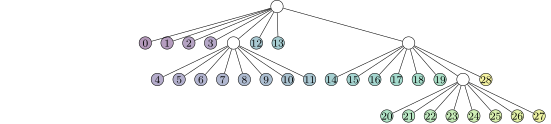
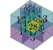
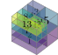
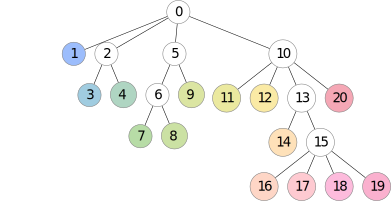

# `DyAda`: A Code for Dyadic Adaptivity in Optimization, Simulation, and Machine Learning

[](https://github.com/freifrauvonbleifrei/DyAda/actions/workflows/python-package.yml/)

[](https://www.gnu.org/licenses/gpl-3.0)

## Dyadic Adaptivity

Dyadic adaptivity means: A given hypercube of 2 or more dimensions may or may not
be subdivided into two parts in any number of dimensions.
Of the resulting sub-boxes, each may again be subdivided into two in any dimension,
and so forth.

### Why Dyadic Adaptivity?

Currently, the most common approach to adaptivity are octrees, which are a
special type of dyadic adaptivity: Each box is either refined in *every* dimension
or not at all.
For a three-d domain, the tree and the resulting partitioning could look like this:

<!-- 
images generated like this:
```bash
for f in *.tex ; do latexmk -pdf $f ; done
for d in *.pdf ; do inkscape --without-gui --file=$d --export-plain-svg=${d%.*}.svg ; done
rsvg-convert tikz_cubes_solid.svg -w 268 -h 252 -f svg -o tikz_cubes_solid.svg #etc.
``` -->




But maybe you didn't need all this resolution?

Maybe, in the finely-resolved areas, you only needed only *some* of the dimensions
resolved finely:



This is what DyAda provides.

The tree will then look like this:



And you will only have to use 14 degrees of freedom instead of 29!
This reduction will be even stronger if you go to higher dimensions.

## Contributing

Feel free to request features or voice your intent to work on/with DyAda as an 
[issue](https://github.com/freifrauvonbleifrei/DyAda/issues).
Depending on what you are looking for, exciting features may be in preparation,
or they may just be waiting for you to implement them!
