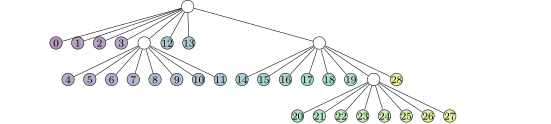
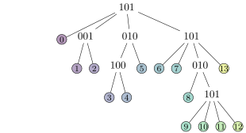

<!--
SPDX-FileCopyrightText: 2025 Theresa Pollinger

SPDX-License-Identifier: GPL-3.0-or-later
-->

# `DyAda`: A Code for Dyadic Adaptivity in Optimization, Simulation, and Machine Learning

[](https://pypi.org/project/dyada/)
[](https://github.com/freifrauvonbleifrei/DyAda/blob/main/pyproject.toml)
[](https://github.com/freifrauvonbleifrei/DyAda/actions/workflows/python-package.yml/)

[](https://app.codacy.com/gh/freifrauvonbleifrei/DyAda/dashboard?utm_source=gh&utm_medium=referral&utm_content=&utm_campaign=Badge_grade)
[](https://www.gnu.org/licenses/gpl-3.0)

## Installation

It's as simple as

```bash
pip install dyada[drawing,matplotlib,opengl]
```

Or, if you would like to change the source code, do

```bash
git clone https://github.com/freifrauvonbleifrei/DyAda.git
# ... git checkout the required version ...
pip install -e DyAda[drawing,matplotlib,opengl]
```

## Dyadic Adaptivity

Dyadic adaptivity means: A given hypercube of 2 or more dimensions may or may not
be subdivided into two parts in any number of dimensions.
Of the resulting sub-boxes, each may again be subdivided into two in any dimension,
and so forth.

### Why Dyadic Adaptivity?

Currently, the most common approach to adaptivity are octrees, which are a
special type of dyadic adaptivity: Each box is either refined in *every* dimension
or not at all.
For a three-d domain, the tree and the resulting partitioning could look like this:

<!-- 
images generated like this:
```bash
for f in *.tex ; do latexmk -pdf $f ; done
for d in *.pdf ; do inkscape --without-gui --file=$d --export-plain-svg=${d%.*}.svg ; done
rsvg-convert tikz_cubes_solid.svg -w 268 -h 252 -f svg -o tikz_cubes_solid.svg #etc.
``` -->



But maybe you didn't need all this resolution?

Maybe, in the finely-resolved areas, you only needed only *some* of the dimensions
resolved finely:


This is what DyAda provides.

The tree will then look like this:



And you will only have to use 14 degrees of freedom instead of 29!
This reduction will be even stronger if you go to higher dimensions.

## Using DyAda

For a quick overview, the following example sticks to only two-dimensional discretizations,
but all algorithms work on (almost) arbitrary-dimensional omnitrees, though DyAda may
become slow for too many dimensions.
(Find the full tutorial code in [dyada_tutorial.py](./dyada_tutorial.py), and more examples
of usage in the extensive test suite in [/test](/test).)

You can start with a regular `RefinementDescriptor`:

```python:dyada_tutorial.py:s:descriptor
import bitarray as ba
import dyada
from random import randint

# %%
descriptor = dyada.RefinementDescriptor(2, [2, 1])
# dyada.plot_tree_tikz(descriptor, filename="simple_tree")
num_dimensions = descriptor.get_num_dimensions()
print(descriptor)
```

Expected output:

```console
RefinementDescriptor('11 01 00 00 ...0 00 01 00 00')
```

This one has four rectangles in the first dimension and two on the second, because
the level `[2, 1]` is passed as base-2 exponents.
If you uncomment the line with `plot_tree_tikz` and you have `latexmk` and some
LaTeX tikz packages installed, the script will generate a `simple_tree.pdf` in the
same folder.

You can use the descriptor and `MortonOrderLinearization` to build a `Discretization`:

```python:dyada_tutorial.py:s:discretization
discretization = dyada.Discretization(dyada.MortonOrderLinearization(), descriptor)
print("initial discretization:")
print(discretization)
```

->

```console
initial discretization:
_________
|_|_|_|_|
|_|_|_|_|
```

If you want to refine a single rectangle at once, you can use `apply_single_refinement`:

```python:dyada_tutorial.py:s:zero
new_discretization, index_mapping = dyada.apply_single_refinement(
    discretization, 0, track_mapping="boxes"
)
print("after refining box 0:")
print(new_discretization)
```

->

```console
after refining box 0:
_________________
|   |   |   |   |
|___|___|___|___|
|_|_|   |   |   |
|_|_|___|___|___|
```

Of course, you can also refine only in a subset of the dimensions:

```python:dyada_tutorial.py:s:random
# select random index and refinement
random_index = randint(0, new_discretization.descriptor.get_num_boxes() - 1)
random_refinement = ba.bitarray("00")
while random_refinement.count() == 0:
    random_refinement = ba.bitarray(
        "".join(str(randint(0, 1)) for _ in range(num_dimensions))
    )
new_discretization, index_mapping = dyada.apply_single_refinement(
    new_discretization, random_index, random_refinement, track_mapping="boxes"
)
print("after refining random box:")
print(new_discretization)
```

->

```console
after refining random box:
_________________
|   |___|   |   |
|___|___|___|___|
|_|_|   |   |   |
|_|_|___|___|___|
```

You can keep running the above and watch your discretization become finer and finer!

To refine many rectangles at once, you can collect the refinements
as `PlannedAdaptiveRefinement` object:

```python:dyada_tutorial.py:s:planned
refining = dyada.PlannedAdaptiveRefinement(discretization)
refining.plan_refinement(0, ba.bitarray("11"))
refining.plan_refinement(1, ba.bitarray("01"))
new_discretization, index_mapping = refining.apply_refinements(track_mapping="boxes")
# dyada.plot_all_boxes_2d(new_discretization, backend="matplotlib", labels="boxes")
print("after applying planned refinements:")
print(new_discretization)
```

->

```console
after applying planned refinements:
_________________
|   |   |   |   |
|___|___|___|___|
|_|_| | |   |   |
|_|_|_|_|___|___|
```

If you uncomment the `plot_all_boxes_2d`, it will show you the discretization
as matplotlib. Other backends are `tikz`, `ascii`(only 2d), and `opengl` (only 3d).

## Contributing

Feel free to request features or voice your intent to work on/with DyAda as an
[issue](https://github.com/freifrauvonbleifrei/DyAda/issues).
Depending on what you are looking for, exciting features may be in preparation,
or they may just be waiting for you to implement them!
