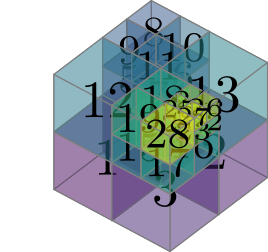

<!--
SPDX-FileCopyrightText: 2025 Theresa Pollinger

SPDX-License-Identifier: GPL-3.0-or-later
-->

# `DyAda`: A Code for Dyadic Adaptivity in Optimization, Simulation, and Machine Learning

[](https://pypi.org/project/dyada/)
[](https://github.com/freifrauvonbleifrei/DyAda/blob/main/pyproject.toml)
[](https://github.com/freifrauvonbleifrei/DyAda/actions/workflows/python-package.yml/)

[](https://app.codacy.com/gh/freifrauvonbleifrei/DyAda/dashboard?utm_source=gh&utm_medium=referral&utm_content=&utm_campaign=Badge_grade)
[](https://www.gnu.org/licenses/gpl-3.0)

## Installation

It's as simple as

```bash
pip install dyada[drawing,matplotlib,opengl]
```

Or, if you would like to change the source code, do

```bash
git clone https://github.com/freifrauvonbleifrei/DyAda.git
# ... git checkout the required version ...
pip install -e DyAda[drawing,matplotlib,opengl]
```

## Dyadic Adaptivity

Dyadic adaptivity means: A given hypercube of 2 or more dimensions may or may not
be subdivided into two parts in any number of dimensions.
Of the resulting sub-boxes, each may again be subdivided into two in any dimension,
and so forth.

### Why Dyadic Adaptivity?

Currently, the most common approach to adaptivity are octrees, which are a
special type of dyadic adaptivity: Each box is either refined in *every* dimension
or not at all.
For a three-d domain, the tree and the resulting partitioning could look like this:

<!-- 
images generated like this:
```bash
for f in *.tex ; do latexmk -pdf $f ; done
for d in *.pdf ; do inkscape --without-gui --file=$d --export-plain-svg=${d%.*}.svg ; done
rsvg-convert tikz_cubes_solid.svg -w 268 -h 252 -f svg -o tikz_cubes_solid.svg #etc.
``` -->




But maybe you didn't need all this resolution?

Maybe, in the finely-resolved areas, you only needed only *some* of the dimensions
resolved finely:


This is what DyAda provides.

The tree will then look like this:


And you will only have to use 14 degrees of freedom instead of 29!
This reduction will be even stronger if you go to higher dimensions.

## Using DyAda

You can start with a regular descriptor:
[dyada_tutorial.py lines 5-12](https://github.com/freifrauvonbleifrei/DyAda/blob/feature_extend_readme/dyada_tutorial.py#L5-L12)

```python
RefinementDescriptor('11 01 00 00 ...0 00 01 00 00')
```

This one has two rectangles in the first dimension and four on the second, because
the level `[1, 2]` is passed as base-2 exponents.
If you uncomment the line with `plot_tree_tikz` and you have `latexmk` and some
LaTeX tikz packages installed, the script will generate a `simple_tree.pdf` in the
same folder.

## Contributing

Feel free to request features or voice your intent to work on/with DyAda as an
[issue](https://github.com/freifrauvonbleifrei/DyAda/issues).
Depending on what you are looking for, exciting features may be in preparation,
or they may just be waiting for you to implement them!
